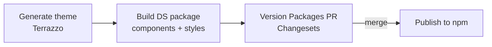

# Cascade DS

A token-driven React design system: design tokens in, themed CSS and typed
components out. It's a pnpm workspaces monorepo whose packages form one
pipeline:

```
tokens  →  generator  →  styles  →  components  →  storybook
(source)   (Terrazzo)    (output)   (React + CSS)   (docs/preview)
```

| Package | What it is |
| --- | --- |
| [`tokens`](./packages/tokens) | Source of truth: [DTCG](https://www.designtokens.org/) JSON in primitive → semantic → component layers, composed by a resolver. |
| [`generator`](./packages/generator) | Runs [Terrazzo](https://terrazzo.app/) on the resolver to produce CSS custom properties and a typed theme object. |
| [`styles`](./packages/styles) | The generated output (`index.css`, `theme.js`/`.d.ts`, `theme-names`, `motion`, `media`). Nothing here is hand-written. |
| [`components`](./packages/components) | React components styled with [Linaria](https://linaria.dev/) + [`class-variance-authority`](https://cva.style/), consuming `@cascade-ds/styles`. API reference: [`API.md`](./packages/components/API.md). |
| [`storybook`](./packages/storybook) | Develop and review components in isolation. Stories: `stories/<ComponentName>.stories.tsx`; Foundations docs (colors): `stories/foundations/`. |

- **Why things are the way they are:** the [ADRs](./adr). Each package's
  README goes deeper on its stage.
- **Contributing a component?** Start with
  [HOW-TO-CONTRIBUTE.md](./HOW-TO-CONTRIBUTE.md): file layout,
  styling/testing/story conventions, and the checks to run before a PR.
- **Architectural rules** (e.g. which tokens a layer may import) are enforced
  automatically as [fitness functions](./fitness), see
  [ADR-005](./adr/ADR-005-fitness-functions.md).

## Stack

| Concern | Choice |
| --- | --- |
| Language | TypeScript (strict), React 19 |
| Monorepo | pnpm workspaces + [Changesets](https://github.com/changesets/changesets) for versioning/publishing |
| Tokens | DTCG JSON composed by a DTCG resolver; generated with Terrazzo (`@terrazzo/cli`, `plugin-css`, `plugin-css-in-js`) |
| Component styling | Linaria (zero-runtime CSS-in-JS) + `class-variance-authority` for variants |
| Bundling | Rollup (`packages/components`) + `@wyw-in-js` for Linaria extraction |
| Unit tests | Vitest + React Testing Library (jsdom), Istanbul coverage |
| Accessibility tests | Storybook `addon-a11y` via `addon-vitest` (Playwright/Chromium) |
| Lint/format | ESLint (typescript-eslint, jsx-a11y, react-hooks) + Prettier |
| Docs/preview | Storybook 10 (`@storybook/react-vite`) |

### Key decisions

- **Terrazzo over Style Dictionary** ([ADR-001](./adr/ADR-001-generator.md)):
  Style Dictionary made light/dark (and future) theme permutations awkward.
  Terrazzo's CSS plugin generates per-theme permutations directly, and
  `plugin-css-in-js` gives typed token references for component styles.
- **Linaria over Styled-Components / Tailwind** ([ADR-002](./adr/ADR-002-styling-library.md)):
  Styled-Components ships a runtime every consuming app pays for on every
  render; Tailwind pushes styling into markup instead of co-located,
  token-driven component styles. Linaria compiles to static CSS at build time:
  Styled-Components' ergonomics with zero runtime cost.
- **Storybook addons over vitest-axe for accessibility** ([ADR-003](./adr/ADR-003-a11y-testing.md)):
  a11y checks started as `vitest-axe` assertions in unit tests, which would
  split "does this component render correctly" across two tools once visual
  regression (also in Storybook, via Playwright) arrived. `addon-a11y` through
  `addon-vitest` checks contrast, visibility and a11y rules against every
  documented story, so Storybook owns that whole class of checks.
- **Changesets over Lerna** ([ADR-004](./adr/ADR-004-lerna-to-changesets.md)):
  pnpm already links workspace packages (`workspace:*`), so Lerna duplicated
  it. pnpm owns linking; Changesets owns versioning and publishing, driven by
  changeset files written per PR. One tool per job.

### Token model: primitive → semantic → component

Tokens are layered so components never hardcode raw values:

```css
color: var(--primitive-color-blue-500);    /* ❌ primitive: never in components */
color: var(--semantic-color-text-primary); /* ✅ semantic: the contract components use */
```

Retheming or rebranding means changing the token source once; components
that only reference semantic (or component) tokens follow automatically. The
full model, including light/dark resolution, is in
[`packages/tokens`](./packages/tokens/README.md) and
[`packages/styles`](./packages/styles/README.md).

### Why a typed theme object

`plugin-css-in-js` types every token path in `packages/styles/theme.d.ts`, so
components import `component` / `primitive` / `semantic` objects instead of
writing `var(--component-button-...)` strings. Mistakes that would only show
up in the browser become compile errors:

- **Renamed or removed tokens** break every consumer at compile time, instead
  of a raw variable string silently resolving to nothing at runtime.
- **Typos** like `component.button.color.secondar.background.default` are
  red-underlined in the editor and fail `tsc`, instead of shipping a button
  with no background that someone has to spot in visual review:

  

- **Discoverability:** autocomplete on `component.button.color.*` lists every
  path that exists, with no need to cross-reference the JSON or generated CSS.
- **Safe renames:** rename a token in the source JSON, rebuild, and TypeScript
  flags every call site still on the old path, including ones a text search
  would miss through aliases.

## Using the components

### Setup

Import the stylesheet **once**, in your app's entry file, before any
component renders, and wrap the app in `ThemeProvider`:

```tsx
import '@cascade-ds/components/styles.css';
import { ThemeProvider, Button } from '@cascade-ds/components';

<ThemeProvider>
  {/* follows the OS preference until setTheme() is called */}
  <Button>Save</Button>
</ThemeProvider>;

<ThemeProvider initialMode="dark">{/* forces dark for this subtree */}</ThemeProvider>;
```

- `styles.css` holds the token custom properties followed by every
  component's styles, so tokens are always defined before the styles that
  read them. The JS never imports CSS, so the package works under SSR,
  Vitest and any bundler without extra loaders.
- The packages are **ESM only** (`import`, not `require`). Jest runs them
  with its ESM support or by transforming `@cascade-ds/*` (add it to
  `transformIgnorePatterns`' exceptions).
- `useTheme()` reads or changes the theme anywhere below the provider.
- **Fonts aren't bundled.** The tokens use Inter for text and JetBrains Mono
  for code, each falling back to system fonts. Load them in your app, in the
  weights the tokens use:

  ```sh
  pnpm add @fontsource/inter @fontsource/jetbrains-mono
  ```

  ```ts
  import '@fontsource/inter/400.css';
  import '@fontsource/inter/500.css';
  import '@fontsource/inter/600.css';
  import '@fontsource/inter/700.css';
  import '@fontsource/jetbrains-mono/400.css';
  ```

### Overriding styles: cascade layers

Everything in `styles.css` sits in
[cascade layers](https://developer.mozilla.org/en-US/docs/Web/CSS/@layer):
`@layer cascade.tokens, cascade.components;`. CSS outside any layer beats CSS
inside one, whatever the specificity or load order, so:

- A `className` you pass to a component **always** overrides its styles, even
  when your bundler loads your CSS first or splits it into chunks.
- An unlayered global reset (`button { padding: 0 }`, `* { margin: 0 }`)
  overrides component styles too. Put resets in a layer before `cascade`:

  ```css
  @layer reset, cascade;

  @layer reset {
    *, *::before, *::after { box-sizing: border-box; margin: 0; }
  }
  ```

- If your own CSS is layered (e.g. Tailwind v4), list `cascade` where it
  belongs, usually right after the reset:
  `@layer theme, base, cascade, components, utilities;`.

### Theme switching is pure CSS

Components hold no theme logic: nothing re-renders and no styles are swapped
when the theme changes. Each component style reads a component token, which
points to a semantic token, which points to a primitive, and only those
variable values differ per theme:

```css
/* Button, as compiled by Linaria */
.primary { background-color: var(--component-button-color-primary-background-default); }

/* styles/index.css, generated by Terrazzo */
:root,
[data-theme='light'] {
  --component-button-color-primary-background-default: var(--semantic-color-brand-primary);
  --semantic-color-brand-primary: var(--primitive-color-orange-300);
}

[data-theme='dark'] {
  --component-button-color-primary-background-default: var(--semantic-color-brand-primary);
  --semantic-color-brand-primary: var(--primitive-color-orange-800);
}
```

An element uses the values of its nearest themed ancestor:

- **No `data-theme` set:** `:root` values apply and a
  `@media (prefers-color-scheme: dark)` block overrides them, so the page
  follows the OS with no JavaScript and no flash on load.
- **`data-theme="dark"` or `"light"` on any element:** that subtree uses that
  theme. Themes nest, so a light card can sit inside a dark page.
  `ThemeProvider` only sets this attribute on its wrapper `<div>`; the
  browser restyles the subtree by itself.

Component tokens are declared in every theme block, not only at `:root`,
because a `var()` resolves where the custom property is declared: a
component token set only at `:root` would keep its light value inside a dark
subtree.

In Storybook, the toolbar's sun/moon button switches every story and docs
page between light and dark:


### Responsive page layout

Breakpoints are generated for your app's own media queries:

```ts
import { media } from '@cascade-ds/styles/media';

css`@media ${media.md} { … }`; // (min-width: 48em)
```

Plain-CSS apps get the same breakpoints as `@custom-media` in
`@cascade-ds/styles/media.css` (needs PostCSS). Details:
[Responsive layout](./packages/styles/README.md#responsive-layout).

### Animation with Motion

CSS transitions read the `semantic.motion.*` tokens through `theme.js` like
any other token. For JavaScript animation, [Motion](https://motion.dev/) is an
**optional** peer dependency; the same tokens are generated as plain numbers
in `@cascade-ds/styles/motion` (durations in seconds, easings as cubic-bezier
arrays).

Everything that needs Motion lives in the `@cascade-ds/components/motion`
entry, which the main entry never imports, so apps that don't animate never
install `motion`. To opt in, `pnpm add motion` and wrap the app:

```tsx
import { ThemeProvider } from '@cascade-ds/components';
import { MotionProvider } from '@cascade-ds/components/motion';

<ThemeProvider>
  <MotionProvider>{/* app */}</MotionProvider>
</ThemeProvider>;
```

Inside `MotionProvider`, every Motion animation defaults to
`motion.duration.normal` and `motion.easing.standard` and respects the OS
reduced-motion setting. Override per animation with the tokens:

```tsx
import { motion as m } from 'motion/react';
import { motion } from '@cascade-ds/styles/motion';

<m.span
  initial={{ opacity: 0, y: 8 }}
  animate={{ opacity: 1, y: 0 }}
  transition={{
    duration: motion.duration.moderate,
    ease: motion.easing.emphasized,
    delay: index * motion.stagger.fast,
  }}
/>;
```

## Getting started

```sh
pnpm install
pnpm build:style          # regenerate packages/styles from the token source
pnpm build                # build styles, then the components package (Rollup)

pnpm test                 # component unit tests
pnpm test:fitness         # architectural fitness functions (ADR-005)
pnpm test:storybook       # Storybook tests, incl. accessibility (addon-a11y)
pnpm test:visual          # screenshot every story in light + dark, compare to baselines
pnpm test:visual:update   # accept intended visual changes (rewrite baselines)

pnpm storybook            # run Storybook

pnpm changeset            # record a version bump for your change (interactive)
pnpm version-packages     # consume changesets and bump package versions
pnpm release              # build and publish the DS (CI only, see below)
```

Visual tests compare against `packages/storybook/visual/__screenshots__` and
run in Playwright's Linux image (Docker must be running), so screenshots match
on every machine and in CI.

## Repo layout

```
packages/
├── tokens/       # token source (DTCG JSON + resolver)
├── generator/    # Terrazzo config, turns tokens/ into styles/
├── styles/       # generated CSS + typed theme (build output, not hand-edited)
├── components/   # React component library
└── storybook/    # Storybook app consuming components + styles
    └── stories/  # <ComponentName>.stories.tsx + foundations/ docs
adr/              # architecture decision records
fitness/          # automated architectural rules (fitness functions), see ADR-005
```

## CI/CD pipeline

Every merge to `main` that touches tokens, generator config or components runs
the stages below in order. Each depends on the previous one's output, so the
published components package is always built against tokens generated in that
same run. That's why it's called Cascade DS.

1. **Generate the theme with Terrazzo:** `pnpm build:style` (runs
   `@cascade-ds/generator`'s build) regenerates `packages/styles` from the
   current tokens. Any Terrazzo lint error (invalid color, dimension,
   typography, …, per `terrazzo.config.ts`) fails the pipeline.
2. **Build the DS package:** Rollup builds `@cascade-ds/components` against
   the freshly generated `@cascade-ds/styles`, so the bundle embeds step 1's
   output, never a stale local build.
3. **Version and publish with Changesets** (`.github/workflows/release.yml`),
   in two passes:
   - While changeset files are pending on `main`, it opens and keeps updating
     a **Version Packages** PR that bumps `@cascade-ds/components` and
     `@cascade-ds/styles` and writes their changelogs.
   - Merging that PR runs `pnpm release`: steps 1–2 run again and the new
     versions are published to npm, so the published artifact is always
     built in the run that publishes it.



Every pull request (`.github/workflows/ci.yml`) runs steps 1–2 plus type
checks, lint, unit and fitness tests, the Storybook accessibility tests, and a
check that the PR includes a changeset (`pnpm changeset` to add one).

Storybook needs no version bump after a release: it imports component source
through the `@/` alias, so it always shows exactly the code being released.
